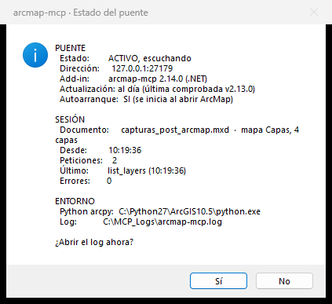
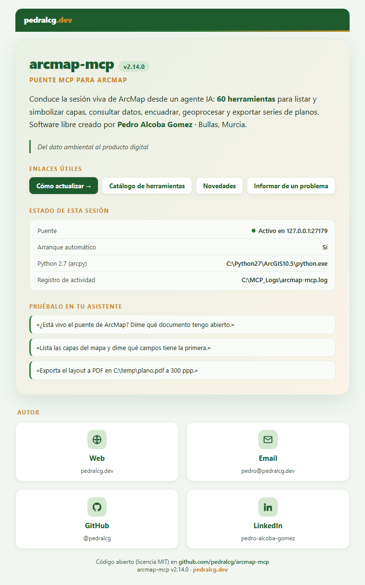

# arcmap-mcp

Servidor MCP local para **ArcMap 10.5–10.8** (validado en 10.5). 100% abierto,
libre y soberano. Permite a un agente IA (Claude Code, Claude Desktop, Gemini CLI,
Antigravity, OpenCode…) conducir una **sesión viva de ArcMap** — listar capas,
ejecutar arcpy, encuadrar, simbolizar, exportar series de planos y **ver el canvas** —
igual que hacen los MCP de QGIS y ArcGIS Pro, pero para ArcMap legacy (que ninguno
de esos cubre).

## Arquitectura (sesión viva, dos piezas)

```
Cliente IA (Claude Code / Desktop / Gemini / Antigravity / OpenCode)
        │  protocolo MCP (stdio)
        ▼
arcmap_mcp_server.py        ← servidor MCP externo (Python 3 + FastMCP): los schemas
        │                      de las 66 herramientas y el contrato con el cliente
        │  socket TCP local  127.0.0.1:27179
        ▼
Add-in .NET (C#)            ← DENTRO de ArcMap: TcpListener + ArcObjects nativo
  ├─ hilo STA de ArcMap     ← capas, layout, exports, render (con cancelación ESC)
  └─ subprocess Python 2.7  ← arcpy out-of-process sobre un snapshot del .mxd
        │                      (execute_arcpy, Data Driven Pages, análisis ambiental)
        ▼
ArcMap ABIERTO y vivo  →  canvas, capas, layout, exportación
```

El patrón de dos piezas —servidor MCP externo + puente dentro del GIS hablando un
protocolo trivial por socket local— está tomado del
[MCP de QGIS](https://github.com/jjsantos01/qgis_mcp) (open source), el estándar de
facto de la categoría. Crédito donde corresponde: este proyecto copia ese diseño y lo
lleva a ArcMap.

Las **dos piezas son una decisión de diseño, no una provisionalidad**:

- **El add-in .NET** corre dentro de ArcMap y toca el documento **vivo** vía
  ArcObjects (COM gestionado por el CLR — estable, sin interop manual). Atiende un
  comando por conexión en el puerto 27179; lo que muta el mapa se ejecuta en el hilo
  STA de ArcMap (el único válido para ArcObjects), y lo que es arcpy puro se delega a
  un **proceso Python 2.7 aparte** que trabaja sobre una copia temporal del documento
  — así un análisis largo **no congela la interfaz de ArcMap**.
- **El servidor externo** expone las `@mcp.tool()` por stdio — el transporte
  que soportan todos los clientes MCP — y reenvía cada comando por TCP local. Servir
  HTTP desde el propio add-in se evaluó y se descartó: no hay SDK MCP para .NET
  Framework 4.5, `HttpListener` exige reservas URL ACL con permisos de administrador
  (rompería la instalación de un clic) y los clientes stdio necesitarían un proxy
  igualmente.

## Estructura del repo

```
arcmap-mcp/
├── src/      arcmap_mcp_server.py   ← servidor MCP (regístralo en tu cliente IA)
│             auditor_mxd.py · exportar_mxd.py ← procesos hijo Py2.7 de audit_folder y export_mxd_lote
├── addin/    ArcmapMcp.AddIn/       ← código C# del add-in (+ runner.py embebido)
│             dist/arcmap-mcp.esriaddin  ← add-in listo para instalar
│             build.ps1              ← build sin Visual Studio (dotnet CLI)
├── docs/     INSTALL.md · TOOLS.md · ROADMAP.md · img/ (capturas)
├── tests/    test_client_protocol.py  ← tests automáticos (no necesitan ArcMap)
│             test_runner_py27.py      ← el runner y el auditor bajo Python 2.7, sin arcpy
│             regresion_sesion_viva.py ← barrido manual del catálogo (ArcMap vivo)
│             regresion_ddp.py         ← barrido del atlas (Data Driven Pages, solo lectura)
│             sonda_puente.py          ← sonda manual de un comando suelto
├── INSTALAR.bat · ACTUALIZAR.bat · install.ps1 · LEEME.txt ← instalación de un clic
├── start-arcmap-mcp.ps1 · empaquetar.ps1 · requirements.txt · CHANGELOG.md · LICENSE · README.md
```

| Pieza | Dónde corre | Qué es |
|---|---|---|
| `addin/dist/arcmap-mcp.esriaddin` | **dentro de ArcMap** (.NET/CLR) | El add-in: socket + ArcObjects + subprocess arcpy |
| `src/arcmap_mcp_server.py` | externo (Python 3) | Servidor MCP que registras en tu cliente IA |
| `start-arcmap-mcp.ps1` | Windows | Lanzador: prepara venv, vigila el túnel, hace ping |

> **arcmap-mcp se instala en `C:\mcp\arcmap-mcp`**, extraigas el ZIP donde lo extraigas:
> el instalador copia ahí el paquete y registra esa ruta en tus clientes IA, así que la
> carpeta donde descomprimiste el ZIP se puede borrar después. Para otra ubicación,
> `INSTALAR.bat -Destino D:\otra\carpeta` (fuera de carpetas sincronizadas tipo
> Drive/Dropbox). Si clonas con git, se usa la carpeta del clon.

## Herramientas MCP

**66 herramientas** sobre ArcMap 10.5 (ver `docs/TOOLS.md` para el catálogo completo con
firmas, ejemplos y los matices de ejecución de cada grupo).

Qué significa «probado», que conviene decirlo con precisión:

- `tests/regresion_sesion_viva.py` hace **222 comprobaciones contra una sesión de ArcMap
  real** y cubre unas **42 de las 66** tools, con sus casos de error. 🔴 **Modifica el
  documento abierto** (añade capas, cambia simbología, lanza geoprocesos): se lanza contra
  un mxd de pruebas, nunca contra un proyecto.
- `tests/regresion_ddp.py` cubre las tres tools del atlas (Data Driven Pages) con **14
  comprobaciones**, y es **de solo lectura** sobre el documento: necesita un mxd con atlas
  habilitado, que en la práctica es siempre uno de producción. Exporta a `C:\temp`.
- Otros **56 tests** corren sin ArcMap (protocolo, argumentos, runner Python 2.7 —con 38
  casos propios—, instalador).
- `export_mxd_lote` no pasa por el puente y no está en la regresión: se probó sobre planos
  reales, con salida idéntica byte a byte a la exportada a mano.
- El resto de tools se ha ejercitado **a mano** en trabajo real a lo largo de las
  versiones —series de planos de decenas de páginas, análisis ambiental— pero **no están
  en la regresión automática**, así que un fallo suyo no lo caza nadie hasta que aparece.

Esto no es una salvedad de manual. El 2026-09-21, al cubrir **geodatabases** por primera vez
y al lanzar la regresión **dos veces en la misma sesión**, salió un defecto que llevaba ahí
desde versiones anteriores: las workspace factories dejaban de poder instanciarse y con ellas
`add_layer`, `describe_data` y `list_feature_classes`, hasta cerrar ArcMap. Está corregido en
la 2.12.0 y ya cubierto. Lo que falta por cubrir sigue siendo el sitio donde esperar la
próxima sorpresa: si usas una versión anterior a la 2.12.0, ese fallo está latente.

- **Sin ArcMap abierto** (leen del disco, no pasan por el puente): `describe_mxd`
  (versión declarada de un .mxd sin abrirlo, milisegundos) · **`audit_folder`**
  (inventario de TODOS los .mxd de una carpeta: versión, capas, fuentes rotas y
  definition queries, abriendo cada documento en un proceso aparte con timeout).

- **Esenciales:** `ping` · `get_arcmap_info` · `list_layers` · `zoom_to_layer` ·
  `export_pdf` · `refresh` · **`execute_arcpy`** (código arcpy arbitrario sobre un
  snapshot del documento — ver matiz en `docs/TOOLS.md`).
- **Series de planos (Data Driven Pages):** `list_ddp` · `export_ddp` ·
  `list_layout_elements` · `set_text_element` · `goto_ddp_page` · `set_definition_query` ·
  `set_layer_visibility` · `export_view_png` · `export_jpg` · **`export_mxd_lote`**
  (exporta una lista de .mxd del disco, un proceso por documento: la vía para series).
- **Capas y datos:** `select_by_attribute` · `clear_selection` · `get_unique_values` ·
  `count_features` · `list_fields` · `get_layer_info` · `get_layer_features` · `add_layer` ·
  `remove_layer` · `apply_symbology_from_layer` · `set_scale`.
- **Simbología:** `set_graduated_symbology` (rangos, capas de entidades) ·
  **`set_unique_values_symbology`** (categorías por valores únicos) ·
  **`set_raster_symbology`** (ráster clasificado, estirado o **por valores únicos** —
  NDVI, FCC, P95, pendientes, y máscaras categóricas con valores transparentes) ·
  `apply_symbology_from_layer` (.lyr plantilla).
- **Marcadores espaciales:** `get_bookmarks` · `add_bookmark` · `remove_bookmark` ·
  `goto_bookmark`.
- **Geoprocesamiento y mantenimiento:** `run_geoprocessing` · `save_mxd` · `save_mxd_as` ·
  `list_broken_data_sources` · `repair_data_source`.
- **Visualización y catálogo:** **`get_canvas_screenshot`** (imagen INLINE, el agente
  ve el mapa; cancelable con ESC) · `describe_data` · `list_data_frames` / `set_active_df` ·
  `set_extent` · `get_workspace` / `set_workspace` · `list_feature_classes` /
  `list_tables` / `list_rasters`.
- **Análisis ambiental y teledetección** (requieren Spatial/3D Analyst; corren fuera
  del proceso de ArcMap → **no congelan la GUI**): **`raster_index`** (índices
  espectrales con nombre: NDVI, GNDVI, NDRE, NDWI, MNDWI, NDMI, NBR, SAVI, EVI — con
  mapeo de bandas Sentinel-2 / Landsat) · `hydrology` (cuencas, red de drenaje,
  inundación) · `contours` · `topographic_profile` · `least_cost_path` ·
  `calculate_geometry`.

La filosofía es **híbrida**: `execute_arcpy` es la base universal (cualquier análisis
de ArcMap 10.x se puede expresar con él) y los wrappers existen solo para lo
repetitivo y de alto valor.

### Guía rápida: tu primer plano en 5 pasos

Con el add-in instalado y el servidor registrado en tu cliente IA, esto es el camino
corto de "no he tocado nada" a "tengo un PNG". Pídeselo al agente en lenguaje normal;
entre paréntesis va la herramienta que acabará usando.

1. **Abre ArcMap y pulsa *Iniciar*** en la barra arcmap-mcp. Es el único paso manual, y
   sin él no hay puente.
2. **«¿Está vivo el puente?»** (`ping`). Debe devolver la versión del add-in, el
   documento abierto y el número de capas. Si dice `PUENTE CAIDO`, vuelve al paso 1;
   si dice `ocupado`, ArcMap está trabajando y te dice en qué y desde cuándo.
3. **«Añade esta capa y dime qué hay dentro»** (`add_layer`, `list_layers`,
   `list_fields`). A partir de aquí el agente ya conoce tus datos y sus campos.
4. **«Simbolízala y encuádrala»** (`set_graduated_symbology` para rangos,
   `set_unique_values_symbology` para categorías, `set_raster_symbology` si es ráster;
   luego `zoom_to_layer`).
5. **«Expórtame la vista»** (`export_view_png`, o `export_pdf` para el layout). Si
   quieres ver el resultado sin salir del chat, `get_canvas_screenshot` devuelve la
   imagen en línea.

Dos atajos que ahorran disgustos desde el primer día. Si vas a trabajar sobre .mxd que
no conoces, pasa antes `describe_mxd` o `audit_folder`: leen los ficheros **sin
abrirlos**, así que te dicen versión, capas y fuentes rotas de una carpeta entera sin
riesgo de quedarte esperando a un documento con las fuentes caídas. Y cuando encuentres
un encuadre que vas a repetir, guárdalo con `add_bookmark` y vuelve con `goto_bookmark`.

## Instalación

### Antes de empezar

| Necesitas | Notas |
|---|---|
| **ArcMap 10.5–10.8** | Validado en 10.5, y un usuario lo ha confirmado en **10.8** (build 12790). 10.6 y 10.7 deberían funcionar, pero no hay confirmación: ver [Versiones de ArcMap](#versiones-de-arcmap). |
| **Python 3.10 o superior** | Para el servidor MCP. **Puede que ya lo tengas**: el instalador busca también el que viene con QGIS y con ArcGIS Pro, aunque no estén en el PATH. Si no encuentra ninguno, se ofrece a instalarlo con `winget`, o lo descargas de [python.org](https://www.python.org/downloads/windows/). |
| **Python 2.7 de ArcGIS** | **No hay que instalarlo**: viene con ArcMap (`C:\Python27\ArcGIS10.x`). Lo usan el análisis arcpy y las Data Driven Pages. |
| **Un cliente MCP** | Claude Desktop, Claude Code, Gemini CLI, Antigravity u OpenCode. |
| **Conexión a internet** | Solo durante la instalación, para descargar las dependencias del servidor. |

### 1. Descargar

**Sin git** (recomendado si no lo usas): en la página del repositorio, botón verde
**Code ▸ Download ZIP**. Antes de extraerlo, **clic derecho en el ZIP ▸ Propiedades ▸
marcar «Desbloquear» ▸ Aceptar**: Windows marca lo que viene de internet y ese marcado
puede impedir que ArcMap cargue el add-in. Extrae después la carpeta donde quieras (en
Descargas, por ejemplo): al instalar se copia sola a `C:\mcp\arcmap-mcp`.

**Con git:**

```powershell
git clone https://github.com/pedralcg/arcmap-mcp.git C:\mcp\arcmap-mcp
```

### 2. Instalar

**Cierra ArcMap** y haz **doble clic en `INSTALAR.bat`**. Eso es todo: deja arcmap-mcp en
`C:\mcp\arcmap-mcp`, prepara el entorno del servidor, instala el add-in dentro de ArcMap y
registra el servidor en los clientes IA que encuentre en tu equipo.

Si prefieres la terminal, es el mismo trabajo (desde la carpeta que extrajiste):

```powershell
powershell -ExecutionPolicy Bypass -File .\install.ps1
```

> El `-ExecutionPolicy Bypass` hace falta porque Windows no ejecuta scripts `.ps1` con
> su configuración de fábrica. `INSTALAR.bat` ya lo lleva puesto.

Por defecto configura **todos los clientes IA detectados**. Para elegir:
`-Clientes claude-desktop` (o `claude-code`, `gemini`, `antigravity`, `opencode`,
`todos`, `ninguno`). Es idempotente: repítelo tras cada actualización.

### 3. Arrancar y verificar

Abre ArcMap. La barra no aparece sola la primera vez: actívala en **Customize ▸ Toolbars
▸ arcmap-mcp** (ArcMap recuerda después dónde la dejas).


De izquierda a derecha: **Iniciar** y **Detener** el puente, **Estado**, el desplegable de
**Autoarranque**, **Reportar** (un problema) y **Acerca de**. Pon el desplegable en
**«Autoarranque: Sí»** y el puente se levantará solo en esta sesión y en todas las
siguientes. Después:

```powershell
.\install.ps1 -SoloVerificar    # comprueba la instalación y hace un ping real al puente
```

Reinicia por completo tu cliente IA (el registro de servidores MCP se lee al arrancar) y
pídele la herramienta `ping`. Para desinstalarlo todo: `.\install.ps1 -Desinstalar`.

**Si algo no va, el botón Estado** dice si el puente está activo, qué versión del add-in
está cargada (la que ArcMap tiene instalada, que es la que cuenta), si hay una más nueva,
cuántas peticiones y errores lleva la sesión y dónde está el log:



**Acerca de** abre en el navegador una ficha con la versión, el estado de la sesión,
ejemplos de qué pedirle al asistente y los enlaces para actualizar o informar de un
problema:



### 4. Actualizar

El add-in avisa solo cuando hay versión nueva (consulta los tags del repo una vez al día).
Actualizar depende de cómo lo descargaste, y en los dos casos **hay que cerrar ArcMap**:
mientras está abierto mantiene cargado el add-in y no se puede reemplazar en caliente.

| Descargaste… | Para actualizar |
|---|---|
| **con git** | Doble clic en **`ACTUALIZAR.bat`**. Hace `git pull` y reinstala. |
| **el ZIP** | Baja el ZIP nuevo, extráelo donde quieras y doble clic en **`INSTALAR.bat`**: actualiza `C:\mcp\arcmap-mcp`. |

Sin git, **tu actualizador es `INSTALAR.bat`**: no hay un segundo fichero que aprender.
`install.ps1` es idempotente, así que da igual que sea la primera vez o la quinta: borra el
add-in anterior antes de copiar el nuevo, refresca el entorno del servidor y vuelve a
registrar los clientes. `ACTUALIZAR.bat` solo le añade el `git pull` por delante, y si lo
ejecutas sin git te lo dice y no toca nada.

**Tras actualizar el add-in, la barra `arcmap-mcp` no aparecerá sola.** Es el comportamiento
correcto desde la 2.8.2: actívala una vez en *Customize ▸ Toolbars ▸ arcmap-mcp* y ArcMap
recordará su posición. Comprueba con el botón **Estado** que la versión es la que esperabas.

> El servidor MCP (Python) no necesita ceremonia: corre desde `C:\mcp\arcmap-mcp` (o desde tu
> clon git), así que en cuanto el instalador reemplaza los ficheros ya está actualizado. Solo el add-in .NET obliga a cerrar
> ArcMap. Detalle completo en [`docs/INSTALL.md`](docs/INSTALL.md#actualizar).

### Versiones de ArcMap

El add-in se compila contra ArcMap **10.5** y ahí está validado en uso real. ArcMap
carga normalmente add-ins compilados para versiones iguales o anteriores a la instalada,
así que en 10.6–10.8 debería funcionar. **En 10.8 (build 12790) está confirmado** por un
usuario, incluso instalado en una ruta no estándar: el add-in carga, el puente levanta y la
regresión en sesión viva sale limpia (issue #1). En 10.6 y 10.7 aún no hay confirmación:
si lo pruebas, cuéntalo en una *issue*.

**En 10.4 o anterior no funciona**, y el instalador ya no finge lo contrario: si detecta
una de esas versiones lo dice y no instala el add-in (sí prepara el servidor y registra
los clientes). El manifiesto declara `<Target version="10.5">` y la DLL enlaza los
ensamblados ESRI 10.5, así que ArcMap no lo cargaría — y no explica por qué. Para usarlo
ahí hay que **recompilar**: cambiar el `<Target>` de `addin\ArcmapMcp.AddIn\Config.xml`,
apuntar las referencias del `.csproj` a tus ensamblados ESRI y pasar `addin\build.ps1`.

### Instalación manual

Si el instalador no encaja en tu equipo, los pasos equivalentes a mano son los de abajo
(detalle completo, incluida la configuración de cada cliente, en `docs/INSTALL.md`).

### 1. Instalar el add-in en ArcMap

Con **ArcMap cerrado**, doble clic en `addin\dist\arcmap-mcp.esriaddin` ▸ *Install*.

Si al abrir ArcMap no aparece la barra **arcmap-mcp** (el instalador de Esri a veces
falla en silencio), instalación manual: extrae/copia el contenido del `.esriaddin`
(es un ZIP) a
`%USERPROFILE%\Documents\ArcGIS\AddIns\Desktop10.5\{51f4ce63-6bcf-49b2-ae3a-ba2c79ea3e1a}\`
y reabre ArcMap. La barra trae 6 botones: **Iniciar / Detener / Estado / Autoarranque /
Reportar / Acerca de**. **Reportar** abre un issue de GitHub o un email pre-rellenados
con el diagnóstico de la sesión (sin datos de proyecto); el log, que sí puede contener
nombres de capas y rutas, no se adjunta solo. Al abrir ArcMap, el add-in comprueba en
segundo plano si hay una versión nueva en GitHub y lo indica en **Estado** y **Acerca de**
(silencioso si no hay internet).

Pulsa **Iniciar** → MessageBox «Puente iniciado» y el add-in escucha en
`127.0.0.1:27179`. El add-in escribe su log en `C:\MCP_Logs\arcmap-mcp.log`.

### 2. Levantar / vigilar el túnel
```powershell
.\start-arcmap-mcp.ps1            # prepara venv, espera al puente, hace ping
.\start-arcmap-mcp.ps1 -Server    # además arranca el servidor MCP (standalone)
```
El lanzador reintenta hasta que el puente aparece, así que puedes correrlo antes de
arrancar ArcMap: te guía y se conecta solo cuando esté vivo.

### 3. Registrar en tu cliente IA
Ejemplo Claude Code (`.mcp.json` del proyecto o config global). Sustituye `<USUARIO>`
por tu nombre de usuario de Windows:
```json
{
  "mcpServers": {
    "arcmap": {
      "command": "C:/Users/<USUARIO>/AppData/Local/arcmap-mcp/venv/Scripts/python.exe",
      "args": ["C:/mcp/arcmap-mcp/src/arcmap_mcp_server.py"]
    }
  }
}
```
La guía completa de los 5 clientes está en `docs/INSTALL.md`.

### 4. Verificar
Con el puente vivo, pide por MCP la herramienta `ping` → debe devolver la versión del
add-in, el documento abierto y el nº de capas. Luego `list_layers` → tus capas. Todo OK.

## Acceso remoto (opcional)
El add-in escucha **solo en `127.0.0.1`, y eso no se puede cambiar**: no hay variable
ni ajuste para abrir el bind, a propósito. Si ArcMap corre en otro equipo, reenvía el
puerto con un túnel cifrado — SSH (`ssh -L 27179:127.0.0.1:27179 <host>`) o Tailscale —
y el servidor MCP se conecta como si fuera local (`ARCMAP_BRIDGE_HOST` solo si el
extremo local del túnel no es 127.0.0.1).

El túnel no es un rodeo: **termina en el `127.0.0.1` de la máquina de destino**, así
que alcanza este listener sin abrir nada, y de paso cifra y autentica, que es justo lo
que al puente le falta.

> ⚠️ **Seguridad.** El puente expone `execute_arcpy`, es decir **ejecución de código
> Python arbitrario** en la máquina que aloja ArcMap, sin autenticación, sin usuarios y
> sin TLS: quien alcance el puerto ejecuta lo que quiera con los permisos de quien tenga
> ArcMap abierto. El loopback no es una limitación pendiente de levantar, **es la única
> barrera que hay**, y por eso el bind se dejó fijo. Lo que sí es configurable es el
> **puerto**, que no cambia nada de esto: se sigue escuchando solo en loopback.

### Cambiar el puerto: `ARCMAP_BRIDGE_PORT`
Por defecto `27179`. Existe por un motivo concreto: cuando una instancia de ArcMap se
queda **zombi** —viva, respondiendo, pero sin ventana principal— sigue sujetando el
puerto, y sin alternativa ningún ArcMap nuevo puede levantar el puente. Con la variable
tienes vía de escape sin matar procesos.

Es **la misma variable en los dos extremos**: el add-in la lee del entorno del usuario
(defínela **antes** de abrir ArcMap) y el servidor MCP, de su propio entorno o del
bloque `env` de la config del cliente. Si solo la pones en uno, no se encuentran. Se
admite `1024`–`65535`; un valor inválido se ignora con aviso en el log y se vuelve al
`27179`.

## Límites conocidos y rendimiento

- **Qué congela la GUI y qué no.** Las herramientas que corren **fuera del proceso**
  de ArcMap (`execute_arcpy`, las 3 de Data Driven Pages y el análisis ambiental) **no
  congelan la interfaz**: puedes seguir trabajando mientras duran. En cambio
  `run_geoprocessing` (nativo, dentro de ArcMap) y los exports/render sí ocupan el
  hilo de la interfaz mientras se ejecutan — igual que si los lanzaras a mano. Para un
  geoproceso largo sobre datos en disco, `run_geoprocessing(fuera_de_arcmap=True)` lo
  lanza aparte (unos 10 s fijos de arranque; las capas viajan por la ruta de su fuente). El
  render y los exports se pueden cancelar con **ESC**.
- **Semántica de snapshot.** Las herramientas out-of-process trabajan sobre una
  **copia temporal del .mxd** con el estado actual de la sesión: leen el documento
  real (capas, definition queries, atlas), pero **sus cambios al documento no
  repercuten en la sesión viva** (las salidas a disco sí son reales, y los resultados
  de análisis se añaden al mapa al terminar). Para mutar la sesión viva usa las
  herramientas nativas (`set_*`, `add_layer`, …). Coste fijo por llamada: unos
  segundos (snapshot + arranque de Python).
- **Documentos con rutas relativas.** La copia temporal se hace **junto al .mxd
  original** en vez de en `%TEMP%` cuando el documento guarda sus fuentes con rutas
  relativas: llevándola a otra carpeta, esas rutas dejarían de resolver y el snapshot
  abriría con todas las capas rotas. Por eso puede aparecer un fichero oculto
  `~arcmap-mcp-snap_*.mxd` junto a tu documento mientras dura la llamada; se borra al
  terminar, y si alguno quedara huérfano el nombre dice de dónde salió.
- **Atlas grandes:** `export_ddp` sobre un atlas de cientos de páginas puede agotar la
  espera aun con el timeout amplio; exporta por lista de `valores` o por `rango`
  (varias llamadas), que además da feedback por lotes. (No hay parámetro `paginas`:
  la firma es `export_ddp(salida, modo, rango, valores, un_pdf_por_pagina, dpi)`.)
- **Timeouts.** No hay uno: hay cinco en el servidor, y cada uno cubre el grupo de
  tools que el add-in atiende de la misma manera.

  | Variable (servidor) | Default | Qué cubre |
  |---|---|---|
  | `ARCMAP_BRIDGE_TIMEOUT` | 60 s | Tools rápidas: consultas, capas, simbología, navegación |
  | `ARCMAP_GP_TIMEOUT` | 1860 s | Lo que ocupa el hilo de ArcMap: `run_geoprocessing`, `calculate_geometry`, `export_pdf`, `export_jpg`, `export_view_png` |
  | `ARCMAP_FONDO_TIMEOUT` | 2760 s | Lo que va a un handler de fondo: las 3 de Data Driven Pages y las 5 ambientales |
  | `ARCMAP_SAVE_TIMEOUT` | 630 s | `save_mxd` y `save_mxd_as` |
  | `ARCMAP_EXEC_TIMEOUT_CLIENTE` | 930 s | **Solo `execute_arcpy`** |
  | `ARCMAP_EXEC_SESION_TIMEOUT_CLIENTE` | 1560 s | `execute_arcpy` con `serializar_sesion=True`: el add-in gasta hasta 600 s copiando la sesión **antes** de sus 900 s |
  | `ARCMAP_ESPERA_DIBUJO` | 120 s | Los tres export cuando llegan con el mapa **aún dibujando** (E_PENDING, típico justo después de cambiar la vista o las etiquetas): el servidor espera fuera de ArcMap y reintenta cada 3 s |

  `execute_arcpy` **no** va por `ARCMAP_GP_TIMEOUT`: subir esa variable no alarga nada
  allí, que es el error que más tiempo ha costado.

  Cada espera del servidor queda **por encima** del tope que el add-in aplica al mismo
  trabajo (`ARCMAP_EXEC_TIMEOUT` 900 s, `ARCMAP_SUBPROCESS_TIMEOUT` 1800 s, más sus
  topes internos de 1800 s en el hilo de ArcMap y 2700 s en el handler de fondo). Es
  deliberado: así vence primero el del add-in, que mata el subproceso y devuelve un
  error diciendo en qué fase se quedó, en vez de un corte mudo de socket que deja el
  runner huérfano (y un runner huérfano impide cerrar ArcMap). Aparte, tu cliente IA
  puede tener su propio timeout de herramienta MCP, normalmente más corto que todo esto.

  **Dónde se definen, que no es intercambiable.** Las del servidor, en el bloque `env`
  de la config MCP de tu cliente. Las del add-in (`ARCMAP_EXEC_TIMEOUT`,
  `ARCMAP_SUBPROCESS_TIMEOUT`, `ARCMAP_PYTHON27`), como **variables de usuario de
  Windows y antes de abrir ArcMap**: el add-in corre dentro del proceso de ArcMap, que
  no ve nada del `env` del cliente MCP — ponerlas ahí no hace absolutamente nada.
- **Extensiones.** `raster_index`, `hydrology`, `least_cost_path` requieren **Spatial
  Analyst**; `contours`, `topographic_profile` requieren **3D Analyst** (actívalas en
  *Customize ▸ Extensions*). Si falta la licencia, la herramienta devuelve un error claro.
- **Un comando por conexión, en serie.** El puente atiende una orden a la vez; si
  llega otra mientras trabaja responde `busy` de inmediato (sin encolar).
- **El puente vive en UNA instancia de ArcMap, y solo ve esa.** El add-in **se carga en
  todas las ventanas**; lo que es único es el **puerto** (`27179`), así que lo agarra el
  primer ArcMap donde pulses *Iniciar* y en los demás el puente no levanta (queda
  anotado en el log, sin romper nada). Consecuencia práctica que despista: con diez
  ArcMap abiertos, `get_arcmap_info` devuelve **un** documento, y no es un fallo ni una
  limitación de ArcMap, es que las otras nueve son invisibles para el servidor. Si
  esperabas otro documento, el puente está en otra ventana. Trabaja con una única
  instancia siempre que puedas. Desde la **2.10.0**, `ARCMAP_BRIDGE_PORT` (definida
  antes de abrir ese ArcMap) permite levantar un segundo puente en otro puerto — y es
  también la vía de escape cuando un ArcMap que ya no responde deja cogido el `27179`.
- **El workspace es por sesión.** `set_workspace` fija el workspace del add-in (no
  hay `arcpy.env` persistente); se restablece al reiniciar ArcMap.

## Estado
- [x] Add-in .NET nativo (ArcObjects vía CLR, sin runtime Python embebido)
- [x] 66 herramientas, incluido el análisis ambiental (índices espectrales, hidrología,
      curvas, perfiles 3D y ruta de mínimo coste) y series de planos reales de decenas
      de páginas. Cobertura automática: 222 comprobaciones en sesión viva sobre ~42 de
      ellas, más 89 tests sin ArcMap (ver «Herramientas MCP»)
- [x] Geoprocesos arcpy fuera de proceso: la GUI de ArcMap no se congela
- [x] Cancelación de render/exports con ESC (`ITrackCancel`)
- [x] Registrable en 5 clientes (Claude Code/Desktop, Gemini CLI, Antigravity, OpenCode)

## Licencia y contribuciones

El proyecto es **libre y abierto** (MIT): puedes usarlo, modificarlo y desplegarlo sin
coste. Está pensado para organizaciones que siguen atadas a ArcMap 10.x y quieren
automatizar su trabajo cartográfico con agentes IA sin esperar a migrar a ArcGIS Pro.

Las dudas, fallos y propuestas van por **Issues** del repositorio.

## Créditos

- Patrón de arquitectura: [qgis_mcp](https://github.com/jjsantos01/qgis_mcp) (Juan
  Santos), el MCP de QGIS open source.
- MIT — © 2026 Pedro Alcoba Gómez · [pedralcg.dev](https://pedralcg.dev) · GitHub
  [@pedralcg](https://github.com/pedralcg)
